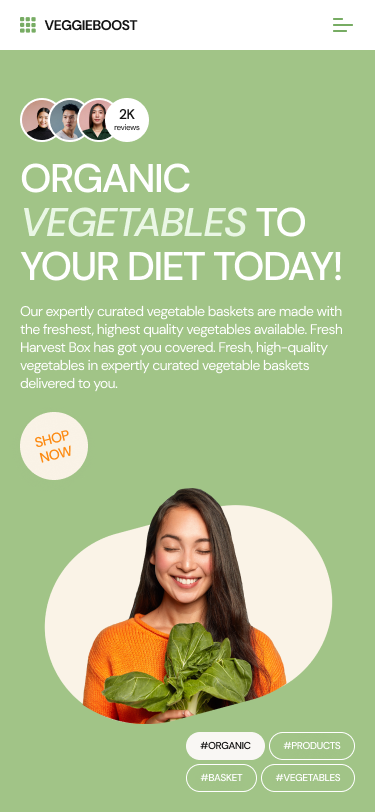
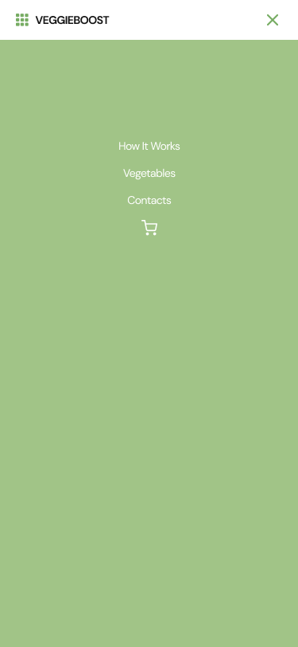

<h1>Sass "VEGGIEBOOST"</h1>

---

## Описание

**Адаптивная целевая страница для розничной торговли продуктами питания.

Это образовательный проект, созданный ученицами школы #itgirlschool.

[Перейти по ссылке](https://lynchdiva.github.io/veggie-boost/)

## О проекте

Veggieboost реализован на препроцессоре Sass. В проекте были использованы следующие технологии:

- Flexbox
- CSS Grid Layout

Этот веб-сайт корректно отображается при любом разрешении - от 320 до 2560 пикселей и выше. Для разрешений менее 680 пикселей меню гамбургеров было реализовано на чистом CSS.

В проекте есть анимация для наведения курсора на кнопки и карточки товаров.

Также в нем есть рабочая навигация по разделам страницы.

## Будущие возможности

- Добавление всплывающего элемента
